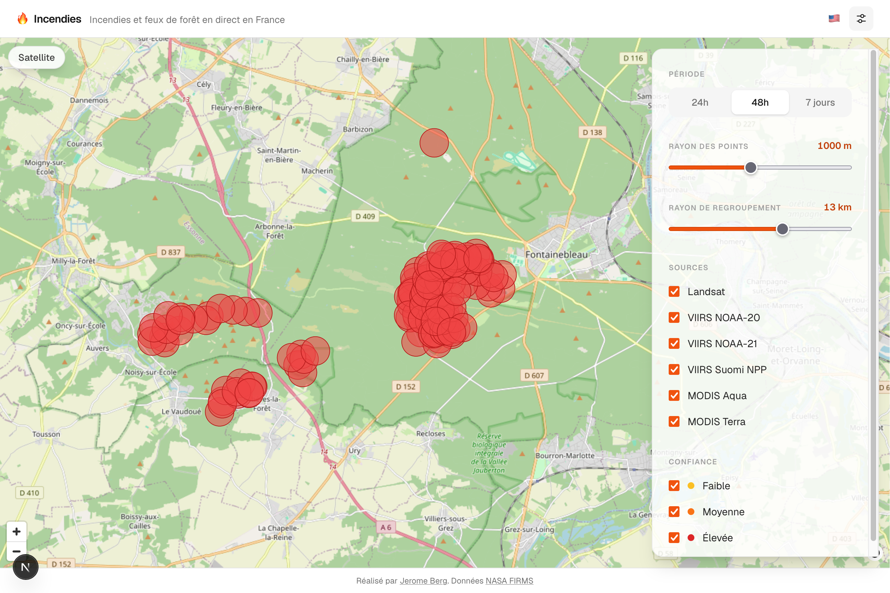

# Wildfire


A map of wildfires in France, using near real-time data from NASA FIRMS.

[FIRMS](https://www.earthdata.nasa.gov/data/tools/firms) (Fire Information for Resource Management System) is a free NASA service that uses satellites to detect heat and fires.



## Stack

- Next.js
- Tailwind CSS
- MapLibre GL JS

## Instructions

```bash
# Install dependencies
npm install

# Copy and fill env
cp .env.example .env.local

# Start dev server
npm run dev
```

Open [http://localhost:3000](http://localhost:3000)

## Notes

- Responses are cached on server for 15mn
- Since FIRMS measures heat to detect fires it can falsely flag some spots.
- Near real-time: global data are available within 3 hours of satellite observation

## Disclaimer

```
LANCE is operated by the ESDIS Project. The information presented through LANCE, GIBS, Worldview, and FIRMS are provided “as is” and users bear all responsibility and liability for their use of data, and for any loss of business or profits, or for any indirect, incidental or consequential damages arising out of any use of, or inability to use, the data, even if NASA or ESDIS were previously advised of the possibility of such damages, or for any other claim by you or any other person. Due to the spatial resolution and other characteristics of these data, their use for tactical decision-making or informing about conditions at a local scale are not advised.

ESDIS makes no representations or warranties of any kind, express or implied, including implied warranties of fitness for a particular purpose or merchantability, or with respect to the accuracy of or the absence or the presence or defects or errors in data, databases of other information. The designations employed in the data do not imply the expression of any opinion whatsoever on the part of ESDIS concerning the legal or development status of any country, territory, city or area or of its authorities, or concerning the delimitation of its frontiers or boundaries. For more information please contact Earthdata Support: earthdata-support@nasa.gov.
```